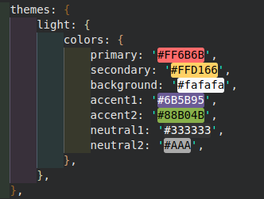

# Drinks Catalog

## Sobre o projeto
Se trata de uma aplicação em Vue 3 utilizando o framework Nuxt 3 para sua construção
O domínio se trata de um catalogo de bebidas alcoólicas e não alcoólicas.

Requisítos funcionais:
- Visualizar categorias de bebidas
- Visualizar as bebidas de cada categoria
- Visualizar os detalhes de cada bebida
- Buscar bebida por nome
- Favoritar bebidas
- Desfavoritar bebidas

Requisitos não funcionais:
- Utilização dos endpoints da api de drinks: [api](https://www.thecocktaildb.com/api.php)
- Tratamento para erros com statusCode 400 e 500

### Paleta de cores

Para definir as cores eu me inspirei em aplicativos ja consoliados na area de drinks como refêrencia. E o resultado foi este:




## Configuração
### Instale as dependencias:
- Node ^16.10
ou
- Node ^14.18

```bash
# npm
npm install

# pnpm
pnpm install

# yarn
yarn install
```

### Inicializando servidor

Será inicializado em `http://localhost:3000`:

```bash
# npm
npm run dev

# pnpm
pnpm run dev

# yarn
yarn dev
```

## Build


```bash
# npm
npm run build

# pnpm
pnpm run build

# yarn
yarn build
```

##### Preview local do build:

```bash
# npm
npm run preview

# pnpm
pnpm run preview

# yarn
yarn preview
```
